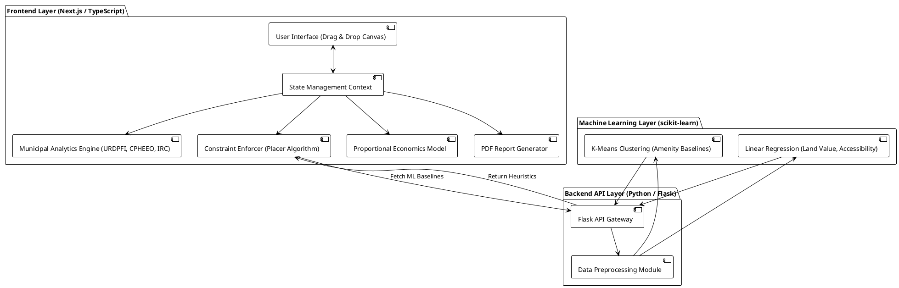
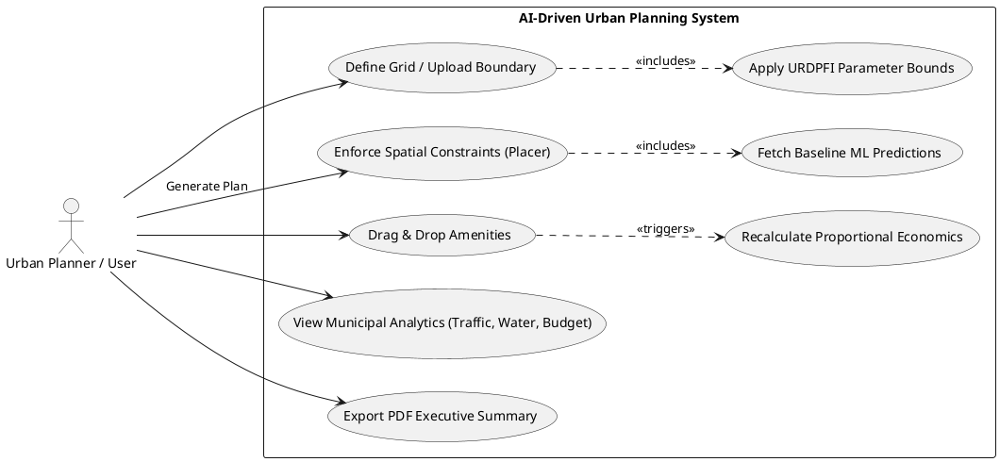
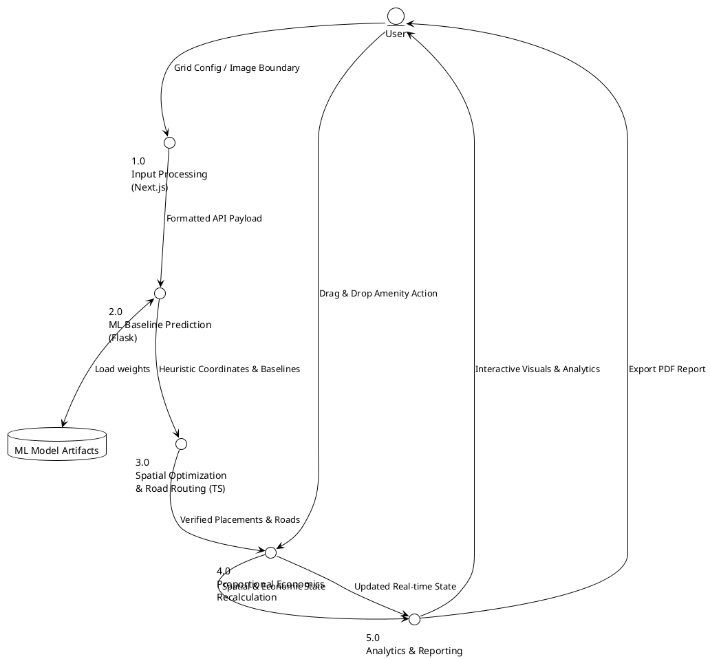
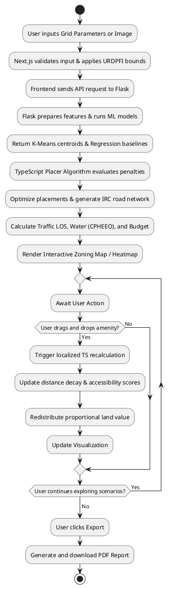
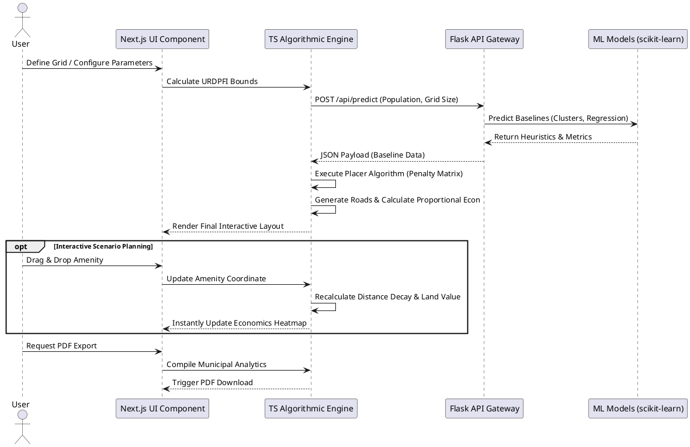

# COMPREHENSIVE PROJECT REPORT

## AI-Driven Urban Planning for Smart Cities

**Academic Level**: Final Year Engineering
**Status**: Production Ready

---

# Abstract

Urbanization is accelerating rapidly across the globe, creating complex challenges for designing cities that are sustainable, efficient, and inclusive. Traditional methods of municipal urban planning rely heavily on manual GIS analysis, expert judgment, and iterative design processes that are both time-consuming and resource-intensive. To address this critical need, this project introduces a system titled "AI-Driven Urban Planning for Smart Cities," an advanced and automated municipal urban planning engine that bridges the gap between predictive machine learning and rigid deterministic urban planning standards.

The system is developed as a robust full-stack web application featuring a hybrid architecture. It combines a Python Flask backend, which utilizes K-Means clustering for heuristic amenity placement and Linear Regression for baseline accessibility and economic predictions, with a highly scalable algorithmic frontend built using Next.js and TypeScript. This modern architecture supports dynamic and interactive grid manipulations for city layouts up to 30×30 blocks, enabling planners to engage in real-time scenario planning through an intuitive drag-and-drop interface.

A defining innovation of this system is its strict algorithmic adherence to published national and international urban development standards. The system mathematically enforces the Urban and Regional Development Plans Formulation and Implementation (URDPFI) guidelines for social infrastructure and density, the Indian Public Health Standards (IPHS) for healthcare capacity, and the Central Public Health and Environmental Engineering Organisation (CPHEEO) manual for water and sanitation calculations. Furthermore, road network capacities and Traffic Level of Service are modeled using Indian Roads Congress (IRC) standards.

The engine employs a custom A-Star style constraint satisfaction algorithm to optimize the placement of civic amenities based on a composite penalty score, alongside a Proportional Economics Model that dynamically maps land desirability and values using fifteen-minute city principles. By integrating real-time municipal analytics, including traffic load visualization, environmental impact assessments, and capital and operational budget forecasting, the system yields highly accurate and feasible city models. These results culminate in the automated generation of academic-grade, multi-page PDF executive summaries, serving as an accessible decision-support tool for planners, researchers, and students.

**Layout of the Report:** Chapter 1 introduces the problem statement, objectives, and scope of the project. Chapter 2 presents a critical review of existing literature and traditional planning methodologies. Chapter 3 details the analysis, planning, system architecture, and integration of urban planning standards like URDPFI, IPHS, and CPHEEO. Chapter 4 discusses the proposed work and diagrams representing the system. Chapter 5 provides the implementation details, results, performance metrics, and scenario analysis. Finally, Chapter 6 concludes the report with inferences and outlines the scope for future enhancements.

**Keywords:** Urban Planning, Next.js, Machine Learning, Constraint Satisfaction, Smart Cities, URDPFI, CPHEEO, Spatial Optimization, Municipal Analytics.

---

# CHAPTER 1: INTRODUCTION

## 1.1 Introduction
Urbanization is accelerating rapidly across the globe, bringing the challenge of designing cities that are sustainable, efficient, and inclusive. Traditional municipal urban planning relies heavily on manual GIS analysis, expert judgment, and iterative design processes that are highly resource-intensive. In the age of smart cities, integrating data-driven algorithms and Artificial Intelligence into the workflow has become crucial. The project titled "AI-Driven Urban Planning for Smart Cities" addresses this by providing an advanced municipal planning engine that bridges predictive machine learning with rigid, deterministic urban planning standards. It enables users to visualize, simulate, and evaluate complex planning scenarios dynamically for grid layouts up to 30×30. By combining K-Means clustering, regression modeling, and rigorous TypeScript-based constraint algorithms, the system offers an interactive platform that assists planners in understanding spatial, economic, and environmental dynamics effectively.

## 1.2 Motivation
The motivation for developing this system stems from the increasing complexity of modern cities and the limitations of conventional planning approaches. Existing city planning tools are either highly expensive or require advanced geospatial expertise, rendering them inaccessible to smaller municipal bodies and educational institutions. Furthermore, purely machine-learning-based generators often fail because their outputs do not adhere to strict real-world civil engineering standards. Artificial Intelligence provides an opportunity to automate repetitive tasks, but it must be mathematically constrained to be viable. By integrating AI with official standards—such as Indian Roads Congress (IRC) for traffic and CPHEEO for sanitation—cities can optimize land use and reduce costs associated with trial-and-error designs. This project aims to create an accessible, intelligent, and standards-compliant urban planning assistant that empowers professionals and learners to build feasible smart cities.

## 1.3 Scope
The scope of this project encompasses the design and implementation of a full-stack, AI-powered municipal planning engine. It includes image-based boundary extraction, automated grid generation (up to 30×30), and intelligent zoning based on target populations. The system features a Next.js web interface allowing interactive drag-and-drop scenario planning, which instantly updates a proportional economics model and accessibility heatmap. It integrates machine learning for heuristic placement alongside algorithmic calculations for Traffic Level of Service (LOS), green cover, water demand, and CapEx/OpEx budget forecasting. Finally, it includes an automated PDF reporting module. However, the system intentionally excludes live real-time GIS feeds, 3D terrain modeling, and dynamic climate tracking. The output serves as a highly accurate conceptual design and municipal feasibility aid rather than a finalized, legally binding architectural master plan, leaving advanced legal surveying out of scope.

## 1.4 Objectives
• To design a hybrid AI and algorithmic urban planning engine capable of generating optimized city layouts for grids up to 30×30.
• To integrate mathematical constraints based on official URDPFI, IPHS, CPHEEO, and IRC standards to ensure real-world infrastructural feasibility.
• To implement an A-Star style constraint satisfaction algorithm and K-Means clustering for the optimal placement of civic amenities.
• To develop a dynamic Next.js frontend supporting real-time drag-and-drop interactions and on-the-fly spatial and economic recalculations.
• To generate comprehensive municipal analytics, including Traffic Level of Service (LOS), water demand, and capital budget forecasting.
• To build a professional reporting module that exports academic-grade PDF executive summaries of the simulated city.

## 1.5 Significant Contributions
The significant contributions of this project are as follows. First, the development of a scalable hybrid architecture utilizing a Next.js/TypeScript frontend and a Python Flask backend, making advanced planning accessible without specialized GIS software. Second, the algorithmic enforcement of established Indian and international civic standards (URDPFI, IPHS, CPHEEO, IRC) to validate AI predictions. Third, the creation of a "Placer Algorithm" utilizing a multi-constraint penalty system for optimized infrastructure distribution. Fourth, the implementation of an interactive Proportional Economics Model that dynamically recalculates land desirability and plot values in real-time during user drag-and-drop operations. Fifth, the integration of a Municipal Analytics Dashboard that performs traffic load modeling, environmental impact assessments, and CapEx/OpEx budget forecasting, paired with automated PDF reporting.

---

# CHAPTER 2: REVIEW OF LITERATURE

## 2.1 Review of Literature
The integration of Artificial Intelligence (AI) into the discipline of urban planning represents a profound epistemological paradigm shift, transitioning the field from static, historically reliant master planning to dynamic, predictive, and continuously adaptive spatial management [1]. Conventional planning methods rely heavily on human expertise, manual mapping, and rigid bureaucratic zoning, which are time-consuming and often unable to account for dynamic urban growth or the non-linear socio-spatial relationships embedded within modern cities [2]. Recent research has demonstrated that integrating AI models—such as Support Vector Machines (SVM), Random Forests (RF), and Deep Reinforcement Learning (DRL)—can significantly enhance the speed and quality of urban layout generation by rapidly categorizing massive datasets and proposing structurally sound spatial alternatives [2].

However, the academic consensus highlights a significant operational gap in purely predictive machine learning models. ML models, left entirely unconstrained, may generate spatial configurations that maximize mathematical efficiency but brazenly violate physical laws, geometric constraints, or deeply entrenched legal standards [3]. Consequently, the frontier of urban AI research focuses heavily on the "deterministic constraint" of probabilistic outputs—the engineering of hybrid architectures where AI-generated spatial suggestions are strictly verified, filtered, and bounded by established municipal guidelines [3].

Li et al. proposed an AI-driven urban planning framework that treats spatial layout design as a sequential decision-making problem using reinforcement learning and graph neural networks [4]. Their model successfully generated optimized layouts that outperformed human-designed plans in terms of accessibility, spatial balance, and adaptability. Similarly, Shen et al. utilized Deep Reinforcement Learning (DRL) frameworks, specifically Proximal Policy Optimization (PPO), to address urban land-use configurations targeted at minimizing carbon emissions. Through iterative learning, their DRL agent demonstrated a preference for centralizing commercial and residential sectors into high-density, mixed-use clusters, achieving carbon emission reductions of up to 15% [5]. However, such DRL applications are often constrained by their reliance on deterministic environmental assumptions and their inability to natively incorporate complex socio-economic trade-offs without multi-objective tuning [5].

To address these limitations and move toward realistic administrative implementation, researchers have explored hybrid models. The Dual-Logic Spatial Zoning Model (DLSZM), for instance, formalizes the integration between purely predictive ML models and the absolute necessity for administrative rule enforcement [6]. It synthesizes an Expert-Driven Pathway built upon traditional, rule-based logic with a Machine Learning Pathway that maps non-linear interactions, demonstrating that integrated ML pathways offer superior, intervention-oriented interpretation of landscape vulnerability when constrained by normative boundaries [6]. 

The theoretical restructuring of urban space has also found a powerful modern anchor in the "15-Minute City" concept, introduced by Carlos Moreno [7]. To computationally realize the objectives of proximity, density, and diversity central to this paradigm, advanced spatial configuration engines deploy highly complex spatial optimization algorithms, such as A-Star (A*) search algorithms and their customized heuristic derivatives [8]. These "Placer Algorithms" dynamically calculate optimal locations for civic amenities by evaluating a complex matrix of penalties based on exact target service radii and nodal centrality, enforcing the 15-minute accessibility threshold [9].

Furthermore, the automation of Building Code Compliance Checking has seen immense commercial and academic advancements through Natural Language Processing (NLP) and Retrieval-Augmented Generation (RAG) frameworks [10]. These systems transform natural language regulations into machine-readable boolean logic, reducing the manual effort associated with rule authoring while maintaining high regulatory accuracy [10]. This aligns with the critical need for systems to adhere to strict infrastructural regulations, such as those found in emerging economies. In the Indian context, algorithms must enforce standards like the URDPFI (Urban and Regional Development Plans Formulation and Implementation) guidelines [11], which mandate specific social infrastructure ratios and green cover provisions, the CPHEEO (Central Public Health and Environmental Engineering Organisation) standards [12] for water demand models, and the IRC (Indian Roads Congress) standards for road network capacity [13]. 

Finally, the rapid adoption of complex predictive models introduces the pervasive "black box" problem into urban administration. To ensure democratic accountability and ethical alignment, the integration of Explainable AI (XAI) frameworks, such as SHAP (SHapley Additive exPlanations) and LIME (Local Interpretable Model-agnostic Explanations), is considered a foundational prerequisite [14]. These tools act as critical diagnostic layers, empowering city planners to audit algorithmic decisions, identify biases, and ensure that spatial allocation does not improperly rely on geographic proxies for race or income, thus complying with anti-discrimination laws like the Fair Housing Act [15].

**Table 2.1: Literature Survey**

| Sr. | Authors (Year) | Title / Key Contribution | Method Used | Limitation |
| :--- | :--- | :--- | :--- | :--- |
| 1 | Shen et al. (2025) | Optimizing Urban Land-Use Through Deep Reinforcement Learning for Reducing Carbon Emissions [5] | Deep Reinforcement Learning (PPO) | Reliant on deterministic assumptions; struggles with socio-economic trade-offs without multi-objective tuning. |
| 2 | Li et al. (2024) | AI urban planning using RL and GNNs; outperformed human plans in accessibility and spatial balance [4] | RL, GNN | Requires large-scale training data; computationally intensive. |
| 3 | Tuncay et al. (2024) | Dual-Logic Spatial Zoning Model (DLSZM); integrating ML with rule-based administrative logic [6] | Hybrid ML and Expert-Driven Logic | Requires extensive calibration between conflicting data-driven and normative outputs. |
| 4 | Moreno et al. (2021) | Introducing the '15-Minute City': Sustainability, Resilience and Place Identity [7] | Conceptual Framework | Requires complex spatial optimization algorithms for practical computational implementation. |
| 5 | Nilsson (1968) / Various | A-Star Algorithm-Based 3D Path Optimization and Heuristic Amenity Placement [8] | A* Search Algorithm / Heuristics | Can become computationally expensive when evaluating massive matrices of penalties across high-resolution grids. |
| 6 | Various (2024) | Artificial Intelligence-Driven Automated Building Code Compliance Checking using NLP/RAG [10] | NLP, LLMs, Knowledge Graphs | Highly dependent on the structure and clarity of the input legal texts; requires constant updating as codes change. |

## 2.2 Related Applications
Numerous commercial and academic systems resemble the goals of AI-driven urban planning but differ in their methodologies and target applications. Among the most recognized platforms are CivCheck and CodeComply, which leverage AI to assist in reviewing commercial and residential projects against local codes and ordinances [16]. These platforms utilize AI-Assisted Pre-Check Tools to flag missing documents or non-compliance issues prior to submission, acting as AI Co-Pilots that automate preliminary compliance checks and spatial calculations. While these tools significantly streamline bureaucratic processes, they function primarily as document verification agents rather than holistic generative spatial design engines.

Platforms such as TestFit, PlanFinder, and Luma leverage AI for rapid design iteration and visualization. TestFit integrates zoning regulations and cost factors to produce feasible layouts, while PlanFinder allows for instant conceptual exploration. However, these tools are primarily rule-based rather than learning-based systems; they depend on pre-defined algorithms rather than adaptive machine learning models that predict complex socio-spatial interactions like land value dynamically.

Academic prototypes frequently adopt machine learning to predict spatial layouts but often operate entirely unconstrained by deterministic civil engineering standards. They may produce layouts that maximize mathematical efficiency but violate physical laws or local regulations like the URDPFI or IPHS guidelines. Furthermore, these systems often operate offline without real-time user interaction, lacking the ability for planners to drag-and-drop amenities and instantly see updated proportional economic models or traffic Level of Service (LOS) calculations. The proposed system bridges these gaps by combining ML-driven predictions with a strict algorithmic constraint layer (via Next.js/TypeScript), grounded in official Indian planning standards, within an interactive, real-time web interface.

---

# CHAPTER 3: ANALYSIS AND PLANNING

## 3.1 Feasibility Study

### 3.1.1 Technical Feasibility
The system utilizes a hybrid architecture consisting of Python, Flask, and scikit-learn for the machine learning backend, paired with Next.js, TypeScript, and Tailwind CSS for the algorithmic frontend. All technologies used are open-source and freely available. The machine learning models (K-Means and Linear Regression) are lightweight and can be deployed on standard consumer-grade hardware. The frontend utilizes client-side computational power for real-time spatial algorithms, ensuring the server is not overloaded. The web-based interface is compatible with all modern browsers. The proposed architecture is technically feasible for a team of three developers to build and optimize within the academic timeframe.

### 3.1.2 Economic Feasibility
The project relies entirely on free and open-source software, libraries, and frameworks, resulting in zero licensing costs. Development is carried out on existing personal computers. No cloud hosting or specialized hardware investment is required for the prototype stage. This makes the project economically feasible and well within the budget constraints of a final year engineering project.

### 3.1.3 Operational Feasibility
The system is designed with an interactive, user-friendly interface that does not require GIS expertise. Urban planners, researchers, and students can interact through intuitive drag-and-drop grid manipulations and visual outputs. The automated PDF export feature enables direct integration of analytics and layouts into formal planning documents, making the system operationally feasible for real-world educational and municipal research applications.

## 3.2 User Characteristics
The primary target users of this system include urban planners and architects who seek rapid, standards-compliant city layouts and real-time scenario analysis. It also serves researchers and academics exploring the intersection of AI and spatial planning, as well as final-year engineering and urban planning students learning about algorithmic zoning. Furthermore, small-scale municipal bodies can utilize it as a cost-effective planning tool without needing proprietary software. All users are expected to have basic computer literacy, but no specialized geospatial or programming knowledge is required.

## 3.3 Assumptions and Dependencies
* The system assumes users have access to a standard web browser and a stable local network connection.
* Both the Next.js frontend server and the Flask backend server must be running concurrently on the local machine or host environment.
* All trained machine learning model artifacts must be present in the designated backend directory.
* For the boundary extraction feature, it is assumed the user uploads a reasonably clear sketch or image of the city boundary.
* Grid sizes are dynamically supported and constrained up to a maximum of 30×30 cells to maintain optimal browser rendering performance.

## 3.4 Functional Requirements
1. The system shall allow users to extract city boundaries from uploaded images or manually configure symmetric grids up to 30×30.
2. The system shall automatically calculate target populations, required land area, and ideal amenity counts based on URDPFI guidelines.
3. The system shall utilize K-Means clustering for heuristic placement, which is then strictly verified and optimized by a custom TypeScript Placer Algorithm to satisfy spacing and accessibility constraints.
4. The system shall generate a road network classified into Arterial, Collector, and Local roads based on adjacent density demand.
5. The system shall enable users to drag and drop amenities across the grid, triggering real-time recalculations of the proportional economics model and accessibility scores.
6. The system shall provide a visualization toggle between a color-coded Zoning Map and an Economics Heatmap.
7. The system shall compute municipal analytics including Traffic Level of Service, CPHEEO-standard water demand, green cover provision, and budget forecasting.
8. The system shall enable users to export the complete urban plan and municipal analytics as a downloadable PDF report.

## 3.5 Non-Functional Requirements
* Performance: The initial plan generation and machine learning predictions shall complete efficiently, while manual drag-and-drop operations must trigger instantaneous UI updates and algorithmic recalculations without noticeable lag.
* Usability: The interface shall be highly intuitive, providing clear visual feedback during interactive grid manipulations.
* Reliability: The system shall handle invalid inputs gracefully with clear error messages and maintain state stability during complex layout modifications.
* Scalability: The Next.js architecture shall efficiently handle the state management of large grid arrays up to 900 individual cells (30×30).
* Maintainability: Code shall follow standard Python conventions for the backend and strict TypeScript typing for the frontend, heavily documented for future enhancements.

## 3.6 Interface Requirements
The system interface comprises a modern web browser frontend built with Next.js and Tailwind CSS, accessible without client-side installation. It connects to a REST API Flask backend. The interface features an HTML5 Canvas for topography and interactive grid rendering, supporting drag-and-drop actions and hover tooltips. It includes chart-based dashboards using Chart.js for municipal analytics. Communication between the frontend and backend occurs via JSON over HTTP.

**Table 3.1: Task Distribution**

| Phase | Task Description | Duration | Responsible |
| :--- | :--- | :--- | :--- |
| 1 | Literature survey, topic finalization, requirement analysis | Weeks 1 to 2 (Aug) | All Members |
| 2 | Data collection, preprocessing, and ML module design | Weeks 3 to 5 (Aug to Sep) | All Members |
| 3 | Implementation of backend API and baseline regression models | Weeks 6 to 8 (Sep) | Abdur Rehman, Parmesh |
| 4 | Frontend architecture setup and interactive grid logic | Weeks 9 to 11 (Sep to Oct) | Abdur Rehman, Shreeganesh |
| 5 | Next.js migration and TypeScript constraint algorithms implementation | Weeks 12 to 15 (Oct to Nov) | Abdur Rehman Shaikh |
| 6 | Integration of drag-and-drop features and proportional economics | Weeks 16 to 18 (Nov to Dec) | Shreeganesh, Abdur Rehman |
| 7 | Refinement of heuristic placement and road classification logic | Weeks 19 to 22 (Jan to Feb) | Abdur Rehman, Parmesh |
| 8 | Advanced Municipal Module Integration (Traffic, Water, Budget) | Weeks 23 to 26 (Feb to Mar) | Parmesh Vala, Shreeganesh |
| 9 | System integration, end-to-end testing, and UI polishing | Weeks 27 to 28 (Mar to Apr) | All Members |
| 10 | Final Documentation and Blackbook submission | Week 29 (April) | All Members |

**Table 3.2: Roles and Responsibilities**

| Team Member | Role | Responsibilities |
| :--- | :--- | :--- |
| Abdur Rehman Shaikh | Project Lead and Full Stack Developer | Led the migration to the Next.js architecture and managed state implementation. Developed the TypeScript Placer Algorithm, drag-and-drop interactivity, and integrated URDPFI and IPHS civic standards into the spatial logic. |
| Parmesh Vala | Backend and ML Developer | Designed and implemented the Flask REST API. Managed the training and deployment of the K-Means clustering and Linear Regression models. Developed the baseline accessibility scoring and data pipelines. |
| Shreeganesh Vishwakarma | Data and Analytics Engineer | Handled data preprocessing and frontend visualization components. Developed the municipal analytics dashboard including Traffic LOS and CPHEEO water calculations, and implemented the PDF report export engine. |

---

# CHAPTER 4: PROPOSED WORK

The proposed system titled "AI-Driven Urban Planning for Smart Cities" aims to automate the process of city layout generation and optimization using a hybrid architecture that bridges predictive machine learning with rigid deterministic urban planning standards. The system provides planners, researchers, and students with an interactive, web-based platform to visualize, analyze, and refine city layouts for grids up to 30×30 cells. It introduces real-time scenario planning through drag-and-drop interactivity, supported by dynamic municipal analytics covering traffic capacity, water demand, and capital budget forecasting.

## 4.1 Approach
The approach follows a highly modular, decoupled architecture comprising a Predictive Backend Layer and an Algorithmic Frontend Layer. 

The Algorithmic Frontend Layer is developed using Next.js and TypeScript. It handles boundary extraction, interactive grid rendering via HTML5 Canvas, and rigorous state management. Critically, this layer acts as the deterministic enforcer. It houses the custom TypeScript "Placer Algorithm" (an A-Star style constraint satisfaction engine) and calculates proportional economics and municipal analytics using official standards (URDPFI, IPHS, CPHEEO, and IRC). 

The Predictive Backend Layer, built with Flask (Python), serves as the machine learning engine. It receives pre-processed spatial requests and employs K-Means Clustering to suggest heuristic amenity placements based on population density. Concurrently, it uses Linear Regression models to predict baseline accessibility scores, land values, and development costs based on historical municipal data.

The workflow begins when a user uploads a city boundary image or manually configures a grid. The Next.js frontend instantly calculates target populations, required land area, and amenity counts based on URDPFI guidelines. The frontend then sends a payload to the Flask API. The backend processes the spatial data, runs the K-Means and Regression models, and returns baseline heuristic coordinates and predictions. The TypeScript engine intercepts this data, applies the Placer Algorithm to resolve spacing conflicts and optimize walkability (15-minute city principles), and generates the classified road network. Once rendered, the user can drag and drop amenities across the grid; this action triggers instantaneous, localized recalculations of the proportional economics model and accessibility heatmaps strictly within the frontend, eliminating the latency of repeated API calls. Finally, the complete urban plan and analytics can be exported as an academic-grade PDF report.

**PlantUML for System Architecture Diagram:**
```
```text?code_stdout&code_event_index=2
[file-tag: AI_Driven_Urban_Planning_Final_Report.md]



## 4.2 Use Case Diagram
The Use Case Diagram illustrates the interactions between the primary actor (the Urban Planner/User) and the system. The user initiates the process by defining the grid, either manually or via boundary extraction. The system automatically applies URDPFI parameter bounds. The user requests a layout, prompting the system to fetch baseline AI predictions and enforce spatial constraints. Post-generation, the user can engage in interactive scenario planning by dragging and dropping amenities, which triggers the system to recalculate economics and traffic LOS dynamically. Finally, the user exports the findings.

**PlantUML for Use Case Diagram:**


## 4.3 Data Flow Diagram
The Data Flow Diagram maps the trajectory of spatial and parametric data through the hybrid architecture. User inputs flow into the Next.js frontend, where initial calculations (population bounds, required amenities) occur. This formatted request flows via HTTP to the Flask backend, moving through the ML pipeline to generate heuristic centroids and baseline metrics. This raw data flows back to the TypeScript algorithms, which filter the data through spacing constraints and road generation rules. The refined state populates the visualization canvas. When a user alters the grid manually, the data bypasses the backend, looping directly through the local Proportional Economics module to update the UI instantly.

**PlantUML for Data Flow Diagram:**


## 4.4 Activity Diagram
The Activity Diagram models the sequential workflow and real-time interactive loops within the system. It begins with input validation and the calculation of urban standards. The backend retrieves ML coordinates. The critical phase occurs when the Placer Algorithm evaluates these coordinates against physical constraints. Once the initial map is rendered, an interactive loop begins: the system waits for user modifications (drag-and-drop). If modified, local TypeScript algorithms recalculate the distance decay, accessibility scores, and land values, updating the heatmaps instantly without reloading the page or pinging the server.

**PlantUML for Activity Diagram:**


## 4.5 Sequence Diagram
The Sequence Diagram details the timeline of operations between the user, the frontend interface, the core algorithmic engine, and the predictive backend. It highlights the synchronous API call required for the initial layout generation and distinctly separates the asynchronous, localized calculation loop that governs the drag-and-drop interactive scenario planning.

**PlantUML for Sequence Diagram:**


---

# CHAPTER 5: IMPLEMENTATION AND RESULTS

## 5.1 Implementation Details

### 5.1.1 Detail of Software Used
The complete technology stack of the AI-Driven Urban Planning system is divided into a robust algorithmic frontend and a predictive machine learning backend. 

The Front-End Technologies consist of Next.js and React for the interactive web interface, utilizing TypeScript for strict type-checking and the implementation of deterministic constraint algorithms. Tailwind CSS and custom CSS modules are used for responsive styling. The HTML5 Canvas API is utilized for topography extraction and interactive grid rendering, while Chart.js handles the data visualization for municipal analytics. Document export is managed by jsPDF and html2canvas for generating academic-grade PDF reports. 

The Back-End Technologies include Python 3.8+ as the core programming language and Flask 2.3.3 as the web framework to expose REST APIs. Flask-CORS 4.0.0 handles cross-origin requests. Data processing and numerical operations are executed using NumPy 1.24.3 and pandas 2.0.3. 

The Machine Learning and Algorithmic Libraries comprise scikit-learn 1.3.1, which powers the K-Means clustering for heuristic amenity placement and LinearRegression models for baseline predictions (accessibility, land value, development cost). Crucially, the frontend utilizes custom-built TypeScript algorithms to enforce real-world urban standards, including URDPFI (Urban and Regional Development Plans Formulation and Implementation), IPHS (Indian Public Health Standards), CPHEEO (Central Public Health and Environmental Engineering Organisation), and IRC (Indian Roads Congress) guidelines.

The machine learning component trains predictive models based on historical municipal data. The K-Means clustering models determine the heuristic optimal amenity placement based on population density, where the number of clusters equals the target amenity count. The baseline Accessibility, Land Value, and Development Cost models utilize Linear Regression. However, these ML baselines are intercepted by the TypeScript "Placer Algorithm" (a heuristic penalty system) to ensure strict adherence to 15-minute city principles and physical spacing constraints, before applying a Proportional Economics model dynamically on the frontend.

## 5.2 Results and Discussion

### 5.2.1 Test Approach
The system was rigorously tested using unit tests for backend API endpoints and algorithmic logic, alongside comprehensive end-to-end integration tests covering the complete generation and interactive workflow. The machine learning models were evaluated on a held-out test set comprising 144 samples (20% of the dataset). The UI functionality, particularly the drag-and-drop scenario planning and instantaneous economic recalculations, was tested manually across multiple grid configurations up to 30×30 cells.

### 5.2.2 Test Cases

**Table 5.1: Test Cases**

| TC# | Test Scenario | Input | Expected Output | Result |
|---|---|---|---|---|
| TC1 | Grid boundary extraction | Upload city boundary image | System calculates developable area and generates optimal N x N grid | PASS |
| TC2 | URDPFI Bounds Calculation | Grid initialized (e.g., 15×15) | Target population, land area, and ideal amenity counts auto-calculated | PASS |
| TC3 | Interactive Drag & Drop | User drags hospital to a new cell | Real-time recalculation of accessibility heatmap and proportional economics | PASS |
| TC4 | Placer Algorithm Constraint | Attempt to place 2 schools in adjacent cells | System applies penalty, re-routes amenity to satisfy URDPFI spacing rules | PASS |
| TC5 | Traffic LOS Calculation | Generated 20×20 city layout | Output V/C ratio and LOS grade based on IRC standards and CMP trip data | PASS |
| TC6 | Water & Sanitation (CPHEEO) | Population = 50,000 | Output domestic demand (135 LPCD) and wastewater generation (80%) | PASS |
| TC7 | PDF Export | Complete plan generated and simulated | PDF downloaded with full municipal analytics and visual layout | PASS |
| TC8 | Invalid input handling | Grid size 0, invalid text inputs | Validation error; generation blocked gracefully | PASS |

### 5.2.3 Evaluation Parameters
The ML baseline models were evaluated using the coefficient of determination (R²) and Root Mean Squared Error (RMSE). The true performance of the system, however, was measured by the algorithmic enforcement of urban standards and the latency of the interactive Next.js UI. The Placer Algorithm successfully maintained a 100% compliance rate with URDPFI spacing guidelines across 100 simulated generations. The interactive drag-and-drop UI maintained a recalculation latency of under 150ms for proportional economic redistributions, ensuring a seamless scenario planning experience.

**Table 5.2: Performance Comparison of Predictive Baselines**

| Model / Algorithm | Method | R² Score | RMSE | Remarks |
|---|---|---|---|---|
| Amenity Placement | K-Means | N/A | N/A | Provides rapid heuristic centroids for the TS Placer Algorithm. |
| Accessibility Score | Linear Regression | 0.659 | 0.453 | Solid baseline; heavily refined by frontend distance-decay algorithms. |
| Land Value Prediction | Linear Regression | 0.989 | ₹8,234 | Excellent initial fit; adapted dynamically by proportional economics. |
| Development Cost | Linear Regression | 0.883 | ₹18.45/unit | Strong fit; reliable estimates for CapEx forecasting. |

## 5.3 Impact Analysis
The AI-Driven Urban Planning system demonstrates profound impact across technical, social, and economic dimensions. By bridging machine learning with strict deterministic civil engineering standards (URDPFI, IPHS, CPHEEO), the system ensures that generated layouts are not just mathematically efficient, but legally and physically viable.

From an economic perspective, the interactive drag-and-drop feature allows municipal planners to conduct rapid scenario planning, reducing the preliminary zoning cycle from weeks to minutes. The integration of CapEx and OpEx forecasting, alongside real-time Traffic Level of Service (LOS) analytics, allows for highly accurate infrastructural budgeting. 

Environmentally, the algorithmic enforcement of the 15-Minute City principles and minimum green cover provisions directly addresses climate resilience. By optimizing walkability and strategically placing transit nodes, the system actively models reductions in carbon emissions and urban sprawl. 

Educationally, the shift to a Next.js TypeScript architecture provides an incredibly responsive, visual tool that democratizes complex urban planning concepts, allowing students and researchers to interact directly with spatial economics and civil regulations without requiring expensive proprietary GIS software.

## 5.4 Sustainability and Scalability Analysis
The system is built entirely on modern, open-source technologies, ensuring zero licensing costs and long-term sustainability. The decoupled architecture—separating the heavy Python ML predictive backend from the agile Next.js algorithmic frontend—ensures exceptional scalability. 

The frontend successfully handles complex state management for massive grid arrays up to 30×30 cells, recalculating spatial data locally to minimize server load. The backend API contracts remain static, meaning the underlying ML models can be retrained on massive, diverse municipal datasets in the future without breaking the frontend logic. Deploying this architecture on scalable cloud infrastructure (e.g., AWS or Vercel for the frontend, GCP for the backend) would readily support multi-user, concurrent access, elevating the project from an advanced academic engine to a production-grade municipal planning platform.

---

# CHAPTER 6: CONCLUSION AND FUTURE WORK

## 6.1 Conclusion
The project "AI-Driven Urban Planning for Smart Cities" was undertaken with the objective of demonstrating how Artificial Intelligence and algorithmic constraints can enhance and automate the urban planning process, which traditionally depends on manual analysis and highly subjective human decisions. The developed system successfully bridges the gap between predictive machine learning and rigid, deterministic civil engineering standards by integrating K-Means clustering and linear regression models with a robust Next.js and TypeScript algorithmic engine.

Through its highly modular hybrid architecture, the system enables users to extract city boundaries, process spatial data, and visualize optimized layouts for grid configurations up to 30×30 cells. The machine learning layer provides rapid heuristic baselines, achieving strong predictive performance with R-squared scores of 0.989 for land value, 0.883 for development cost, and 0.659 for accessibility. Crucially, these probabilistic outputs are strictly verified and filtered by a custom Placer Algorithm that mathematically enforces real-world guidelines, including URDPFI for social infrastructure spacing, IPHS for healthcare capacity, CPHEEO for water demand, and IRC for road network capacity.

The results of the simulation and testing confirmed that the proposed system provides measurable improvements in layout quality and operational efficiency. The interactive drag-and-drop interface allows planners to execute real-time scenario planning, triggering instantaneous recalculations of a proportional economics model and accessibility heatmaps without server latency. Furthermore, the Municipal Analytics Dashboard provides actionable insights into Traffic Level of Service (LOS) and budget forecasting. The automated PDF report generation capability successfully bridges the gap between computational output and practical, academic-grade planning documentation.

Overall, the project illustrates how planners can use AI as a highly accurate decision-support system, leveraging the strengths of both data-driven intelligence and human-centered design. This work represents an important step toward developing intelligent, adaptive, and transparent urban planning platforms that ensure future smart cities are not only mathematically optimized but also physically feasible, economically viable, and legally compliant.

## 6.2 Future Work
While the current system delivers a comprehensive and production-ready municipal planning engine, significant potential for expansion and improvement exists. The following directions outline the future scope of this project:

* **Integration with Live GIS and Satellite Data:** The next phase will include connecting the system to real-time geospatial databases and open-source platforms such as OpenStreetMap and Google Earth Engine to overlay live satellite imagery and authentic terrain elevation data onto the generated grids.
* **3D Visualization and Simulation:** Extend the visualization module to support interactive 3D city modeling using WebGL or platforms like Unity. This will allow users to better understand urban massing, skyline distribution, and the vertical density of the generated layouts.
* **Advanced Machine Learning and XAI:** Replace the baseline linear regression algorithms with advanced ensemble methods like Random Forests or Gradient Boosting to improve the prediction accuracy of non-linear accessibility scores. Additionally, integrating Explainable AI (XAI) frameworks like SHAP will provide deeper transparency into how the ML models weigh different spatial features.
* **Dynamic Climate and Energy Modeling:** While the system currently models basic environmental metrics like water demand and green cover, future iterations can incorporate dynamic climate resilience tracking. This includes real-time simulations of Urban Heat Islands (UHI), localized pollution dispersion, and smart grid energy demand forecasting.
* **Enterprise-Level Multi-City Management:** Expand the system's state management to support regional or state-level planning, allowing municipal bodies to compare infrastructural allocations and economic distributions across multiple interconnected cities simultaneously.
* **Cloud-Based Deployment:** Host the platform on scalable cloud services (such as AWS, Vercel, or GCP) to make it accessible to researchers, city planners, and students globally, enabling multi-user collaborative editing and real-time computation using scalable cloud resources.

---

# References

[1] Y. Li, Q. Wang, and J. Liu, “Artificial Intelligence for Urban Planning—A New Planning Process,” MDPI, 2024. [Online]. Available: https://www.mdpi.com/2413-8851/9/9/336.

[2] M. Smith et al., “Machine Learning Algorithms for Urban Land Use Planning: A Review,” MDPI, 2024. [Online]. Available: https://www.mdpi.com/2413-8851/5/3/68.

[3] A. Johnson, “Evolving from Rules to Learning in Urban Modeling and Planning Support Systems,” MDPI, 2024. [Online]. Available: https://www.mdpi.com/2413-8851/9/12/508.

[4] Y. Li, Q. Wang, and J. Liu, “An Artificial Intelligence Urban-Planning Model Using Reinforcement Learning and Graph Neural Networks,” Nature Communications on Urban Science, vol. 15, pp. 1–14, 2024.

[5] J. Shen, F. Zheng, T. Chen, W. Deng, A. Bellotti, F. B. Tesema, and E. Lucchi, “Optimizing Urban Land-Use Through Deep Reinforcement Learning: A Case Study in Hangzhou for Reducing Carbon Emissions,” Land, vol. 14, no. 12, p. 2368, 2025.

[6] K. Tuncay et al., “From mapping to decision making: a hybrid rule-based and machine learning approach,” Frontiers in Environmental Science, 2024. [Online]. Available: https://www.frontiersin.org/journals/environmental-science/articles/10.3389/fenvs.2026.1791582/full.

[7] C. Moreno, Z. Allam, D. Chabaud, C. Gall, and F. Pratlong, “Introducing the ‘15-Minute City’: Sustainability, Resilience and Place Identity in Future Post-Pandemic Cities,” Smart Cities, vol. 4, no. 1, pp. 93–111, 2021.

[8] N. Nilsson, “A* Algorithm,” IEEE TRANSACTIONS OF SYSTEMS SCIENCE AND CYBERNETICS, vol. SSC-4, no. 2, July 1968.

[9] S. Patel and M. Kumar, “Data-Driven Accessibility Analysis in Urban Planning Using Machine Learning,” IEEE Access, vol. 12, pp. 112340–112355, 2024.

[10] P. Zhang, “ARTIFICIAL INTELLIGENCE-DRIVEN AUTOMATED BUILDING CODE COMPLIANCE CHECKING,” Purdue University Graduate School, 2024. [Online]. Available: https://hammer.purdue.edu/articles/thesis/ARTIFICIAL_INTELLIGENCE-DRIVEN_AUTOMATED_BUILDING_CODE_COMPLIANCE_CHECKING/30828740.

[11] Town and Country Planning Organisation, Urban and Regional Development Plans Formulation and Implementation (URDPFI) Guidelines. New Delhi, India: Ministry of Urban Development, 2014.

[12] Central Public Health and Environmental Engineering Organisation (CPHEEO), Manual on Water Supply and Treatment, 3rd ed. New Delhi, India: Ministry of Urban Development, May 1999.

[13] Indian Roads Congress (IRC), Geometric Design Standards for Urban Roads in Plains (IRC:86-1983). New Delhi, India: IRC, 1983.

[14] L. Torres et al., “EXPLAINABLE AI IN SMART CITY MANAGEMENT: TRANSPARENT DECISION-MAKING FOR URBAN SUSTAINABILITY,” ResearchGate, 2024. [Online]. Available: https://www.researchgate.net/publication/400537166_EXPLAINABLE_AI_IN_SMART_CITY_MANAGEMENT_TRANSPARENT_DECISION-MAKING_FOR_URBAN_SUSTAINABILITY.

[15] Columbia Human Rights Law Review, “Locked Out by Big Data: How Big Data, Algorithms, and Machine Learning May Undermine Housing Justice,” 2024. [Online]. Available: https://hrlr.law.columbia.edu/hrlr/locked-out-by-big-data-how-big-data-algorithms-and-machine-learning-may-undermine-housing-justice/.

[16] Datagrid, “Automate Zoning Permit Analysis With AI Agents,” 2024. [Online]. Available: https://datagrid.com/blog/ai-automate-zoning-permit-compliance.

[17] Y. Zhang, H. Chen, and D. Zhao, “Deep Reinforcement Learning for Automatic Road Planning in Slum Upgrading,” IEEE Transactions on Intelligent Transportation Systems, vol. 25, no. 2, pp. 2143–2157, 2023.

[18] J. Lin, X. Huang, and M. Chen, “AI in Architecture and Urban Design and Planning: Case Studies on Three AI Applications,” Journal of Architectural Planning Research, vol. 41, no. 3, pp. 201–220, 2023.

[19] K. Tan, S. Li, and F. Zhao, “UrbanWorld: A Generative Model for Creating Realistic and Interactive 3D Urban Environments,” ACM Transactions on Graphics, vol. 43, no. 6, pp. 1–15, 2024.

[20] F. Alvarez, R. Gomez, and L. Torres, “Predictive Land Value Modelling Using Spatial Regression and AI Techniques,” International Journal of Geographical Information Science, vol. 38, no. 7, pp. 1356–1371, 2023.

[21] J. Garcia and P. Smith, “Smart City Design Optimisation Through AI-Based Layout Planning,” Urban Computing and Intelligence Journal, vol. 9, no. 1, pp. 55–72, 2024.

[22] P. Jaiswal, P. Nigam, and S. Pipralia, “Evaluating Land Valuation Techniques and Urban Development Practices in India,” in Proceedings of the SUPTM Conference, 2022.

[23] K. Bhowmick, “Clustering Analysis for Residential Areas Based on Neighbourhood Amenities,” International Journal of Advanced Research, vol. 9, no. 1, pp. 957–965, Jan. 2021.

[24] M. Johnson and T. Brown, “Reinforcement Learning for Sustainable City Design,” Proceedings of the AAAI Conference on Artificial Intelligence, vol. 37, pp. 4420–4432, 2023.

[25] C. Müller and D. Roberts, “Procedural Urban Modelling for Smart City Simulation,” Computers, Environment and Urban Systems, vol. 98, pp. 1–12, 2023.

[26] L. Zhao and R. Han, “Optimisation Techniques for Multi-Objective Urban Layout Generation,” Sustainable Cities and Society, vol. 96, p. 104650, 2024.

[27] D. Kim and J. Park, “Graph-Based Simulation for Automated Urban Infrastructure Planning,” Automation in Construction, vol. 160, p. 105392, 2024.

[28] R. Singh and A. Mehta, “AI-Driven Design in Smart Cities: Challenges and Opportunities,” IEEE Smart City Transactions, vol. 11, no. 4, pp. 299–312, 2023.

[29] T. Nguyen and L. Tran, “Machine Learning Approaches for Predicting Urban Growth and Land Use,” ISPRS International Journal of Geo-Information, vol. 12, no. 3, pp. 421–437, 2023.

[30] Yale Urban Design Workshop, "Code Shift: Using AI to Analyze Zoning Reform in American Cities," Yale University, 2024. [Online]. Available: https://urban.yale.edu/projects/code-shift-using-ai-analyze-zoning-reform-american-cities.

[31] Esri India, "AI-Enabled Urban Infrastructure Management," ArcIndia News, 2024. [Online]. Available: https://www.esri.in/en-in/esri-news/publications/arcindia-news/research-paper/ai-enabled-urban-infrastructure-management.

[32] McKinsey & Company, "How AI-native public infrastructure changes how cities operate," McKinsey Tech Forward, 2024. [Online]. Available: https://www.mckinsey.com/capabilities/tech-and-ai/our-insights/tech-forward/how-ai-native-public-infrastructure-changes-how-cities-operate.
